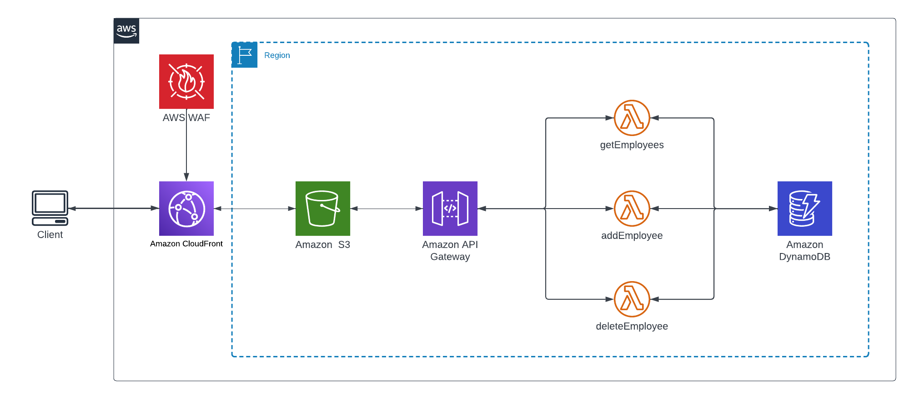
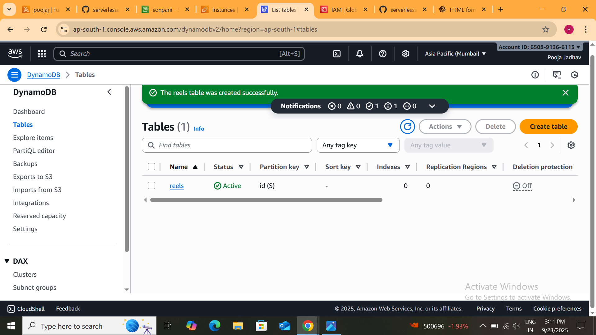
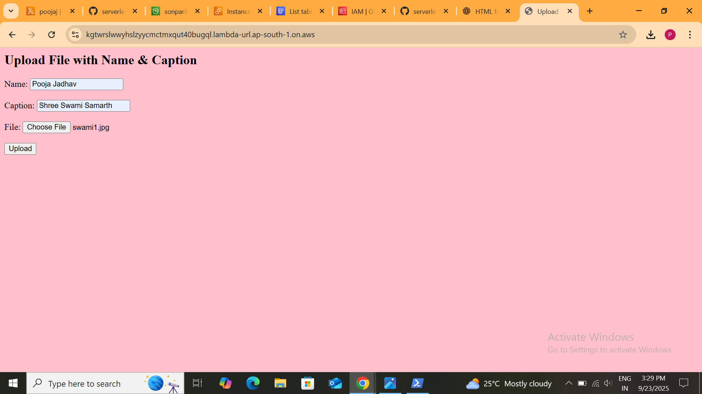

# AWS Serverless File Upload System
## Introduction
### Serverless Info Uploader is a cloud-native application that enables secure file uploads to Amazon S3 with metadata storage in DynamoDB. The application generates temporary download links that automatically expire after 1 hour, ensuring enhanced security for file sharing.

This implementation follows a serverless architecture on AWS where:

Amazon S3 provides secure, scalable file storage

AWS Lambda handles serverless computation and business logic

Amazon DynamoDB stores file metadata and access information

AWS IAM manages secure access permissions

The architecture ensures cost-effectiveness, automatic scaling, and minimal maintenance overhead while maintaining high security standards.
### 1. Architecture Overview

# 2. AWS Services Configuration
## 2.1 S3 Bucket Setup
### .Name: poojajadhav
### Region: ap-south-1 (Asia Pacific - Mumbai) ### 
### Configuration: Private access with temporary URL generation 
### Purpose: Secure file storage with expiration policies

## 2.2 DynamoDB Table Configuration
### Table Name: reels
### Partition Key: id (String)
### Capacity Mode: On-demand
### Purpose: Stores file metadata including
### Unique file ID

#### Original filename

#### Upload timestamp

#### Expiration time

#### S3 object reference

#### Download count

## 2.3 IAM Policies and Roles
#### Execution Role: AWS Lambda Basic Execution Role
#### Managed Policies: Amazon DynamoDB Full Access Amazon S3 Full Access

#### Purpose: Grants Lambda function necessary permissions to access S3 and DynamoDB

# 3. Application Workflow
## File Upload Process
1.User Interface: Web form for file selection and upload

2.Lambda Trigger: Upload event triggers Lambda function execution

3.S3 Storage: File is securely stored in S3 bucket with unique identifier

4.Metadata Recording: File information stored in DynamoDB table

5.URL Generation: Temporary download link created with 1-hour expiration

6.User Feedback: Success response with download link provided
# 4.Temporary URL Mechanism
#### Pre-signed S3 URLs with 1-hour expiration
#### No permanent public access to files

#### Secure sharing without exposing bucket contents
#### Automatic cleanup of expired links

## 5. Security Features
## Access Control
#### IAM roles with least privilege principle
#### No public read/write access to S3 bucket
#### Fine-grained DynamoDB access control
## 5.2 Data Protection
#### Temporary URLs with automatic expiration
#### No persistent public access to files
#### Secure metadata storage in DynamoDB
## 5.3 Monitoring and Logging
#### CloudWatch logging for all Lambda executions
#### S3 access logging enabled
#### DynamoDB query logging
## 6.1 Deployment Steps
## 1. Infrastructure Setup
### Create S3 bucket
###### aws s3api create-bucket --bucket poojajadhav--region ap-south-1
## Create DynamoDB table
###### aws dynamodb create-table --table-name reels\--attribute-definitionsAttributeName=id,AttributeType=S \ --key-schema AttributeName=id,KeyType=HASH \
## 6.2 IAM Role

{
  "Version": "2012-10-17",
  "Statement": [
    {
      "Effect": "Allow",
      "Action": [
        "s3:PutObject",
        "s3:GetObject",
        "s3:DeleteObject"
      ],
      "Resource": "arn:aws:s3:::poojajadhav/*"
    },
    {
      "Effect": "Allow",
      "Action": [
        "dynamodb:PutItem",
        "dynamodb:GetItem",
        "dynamodb:UpdateItem",
        "dynamodb:DeleteItem"
      ],
      "Resource": "arn:aws:dynamodb:ap-south-1:*:table/reels"
    }
  ]
} 
## 6.3 Lambda Function Deployment
#### Runtime: Python 3.9/Node.js 16.x
#### Handler: Process upload events
#### Environment variables:
#### S3_BUCKET: poojajadhav
#### DYNAMODB_TABLE: reels
## Lambda Function 

## Upload Success

## Cost Optimization
#### Pay-per-use pricing for all services
#### No idle resource costs with serverless architecture
#### Automatic scaling based on demand
#### No infrastructure maintenance required
## Project Summary
### By leveraging S3 for storage, Lambda for computation, DynamoDB for metadata, and IAM for security, this solution provides a maintainable and highly available file upload service without needing server management.

### This implementation follows best practices for serverless applications, including proper security configurations, error handling, and cost optimization while providing a seamless user experience for secure file sharing.